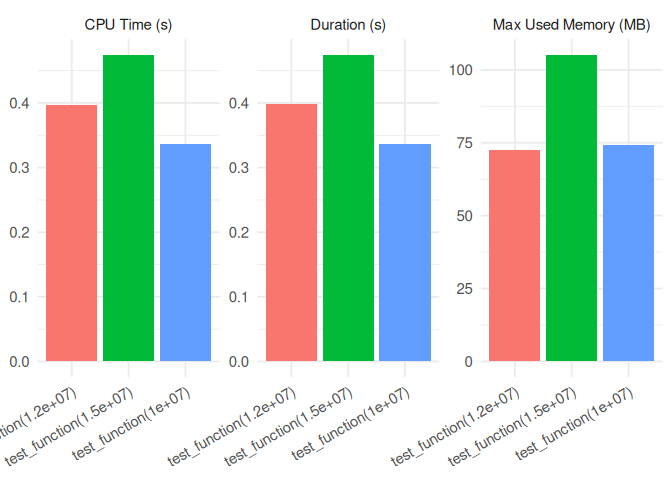

<!-- README.md is generated from README.Rmd. Please edit that file -->

# timemoir

<!-- badges: start -->

[](https://github.com/nbc/timemoir/actions/workflows/R-CMD-check.yaml)
[](https://app.codecov.io/gh/nbc/timemoir?branch=main)
<!-- badges: end -->

## Overview

The goal of timemoir is to benchmark the memory usage, CPU usage, and
execution time of functions that cannot be accurately profiled using
traditional benchmarking tools. It is particularly useful for profiling
**long-running or memory-intensive operations**, such as those involving
in-memory analytics with `arrow` or `duckdb`.

Unlike traditional profilers like `Rprof()` or `profmem`, `timemoir`
uses a **forked R process** to run each function in isolation, while the
parent process monitors memory consumption via
[`ps::ps_memory_info()`](https://ps.r-lib.org/) and `proc.time()`.

It’s a simple but effective approach.

## Features:

- Memory Profiling: Tracks initial and peak memory usage (`start_mem`,
  `max_mem`)
- CPU Usage: Measures user and system CPU time
- Elapsed Time: Captures real execution time (`proc.time`)
- Error Handling: Catches and reports errors without stopping the
  benchmarking loop
- Repetition: Supports repeated benchmarking with `n` runs per function

> ❗ **Note**: This package works only on **Unix**. It relies on
> parallel package to fork a process.

## Installation

To install the package, run the following command in your R console:

``` r
devtools::install_github("nbc/timemoir")
```

## Example

``` r
library(timemoir)
library(ggplot2)

test_function <- function(n) {
  x <- rnorm(n)
  mean(x)
}

res <- timemoir(
  test_function(1.2e7),
  test_function(1.5e7), 
  test_function(1e7)
)
res
#> # A tibble: 3 × 7
#>   fname                  duration error start_mem max_mem cpu_user cpu_sys
#>   <chr>                     <dbl> <chr>     <int>   <dbl>    <dbl>   <dbl>
#> 1 test_function(1.2e+07)    0.399 <NA>     111236  185476    0.336   0.061
#> 2 test_function(1.5e+07)    0.475 <NA>     111236  219012    0.404   0.071
#> 3 test_function(1e+07)      0.337 <NA>     111236  187140    0.277   0.059

autoplot(res)
```



## Why use `timemoir`?

Benchmarking tools like `bench::mark()` or `microbenchmark()` are
powerful for **fast** functions. But if you’re dealing with:

- Queries that stream data from disk,
- `duckdb::dbGetQuery()` on large tables,
- `arrow::open_dataset()` and lazy evaluations,
- or R functions with unpredictable memory usage,

…then `timemoir` gives you visibility into what’s really happening — in
memory, CPU and in time.
